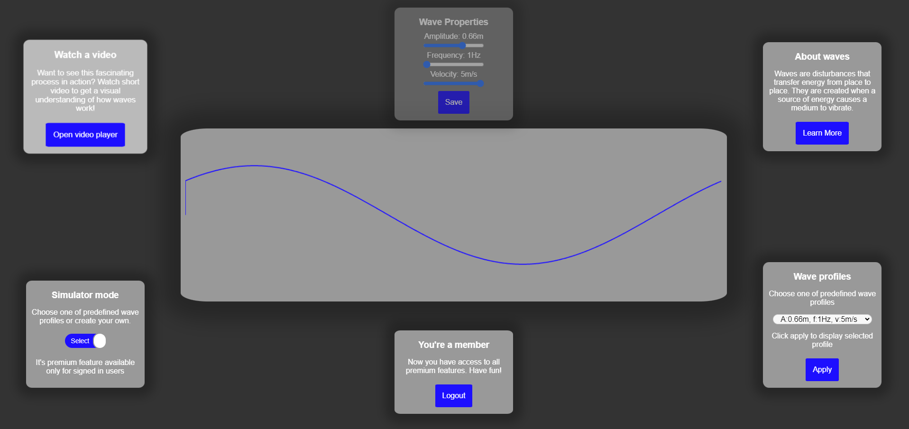

# Wave Simulator

This project is a credit project for the Web Techniques course. Its main goal is to familiarize the user with wave properties. 

## Client-side Technologies

- JavaScript: The application utilizes various JavaScript functionalities, including:
  - Fetch API: Used for making HTTP requests to the server.
  - Promises: Used for handling asynchronous operations and managing the flow of data.
  - innerHTML: Used for dynamically manipulating the content of HTML elements.
  - DOM elements: Used for accessing and manipulating the structure and content of the HTML document.
  - Wave Worker: Used for displaying animation and simulating wave behavior.
  
## Server-side Technologies

- Node.js: The server-side of the application is built using Node.js, a JavaScript runtime environment that allows for server-side scripting.
- JWT Authentication: The project utilizes JWT (JSON Web Tokens) for authentication, providing secure access to the server-side functionalities.
- MongoDB: The application uses MongoDB, a NoSQL database, to store and manage data.
- Mongoose Schema: MongoDB schemas are employed to define the structure and validate the data stored in the database.
- Express: The application uses Express, a web application framework for Node.js, to handle routing and middleware.
- Cookie Parser: The application utilizes the `cookie-parser` middleware to parse cookies sent by the client.
- dotenv: The project uses `dotenv` to load environment variables from a `.env` file.

## Functionalities for Unauthorized Users

- Interactive wave simulation: Unauthorized users can interact with the wave simulator to visualize the behavior of waves in different scenarios.
- Wave customization: Unauthorized users can customize the properties of the waves, such as adjusting the amplitude, frequency, and phase.
- Video about Waves: Unauthorized users can watch a video about waves.
- Wave description: Unauthorized users can read a short description about waves.

## Functionalities for Logged-In Users

In addition to the functionalities available for unauthorized users, logged-in users have access to the following features:

- Wave profiles creation: Logged-In users can create and save custom wave profiles with specific properties.
- Wave profile selection: Logged-In users can select and load previously saved wave profiles.
- Animation: Logged-In users can animate the selected wave profiles to observe their behavior in real-time.

